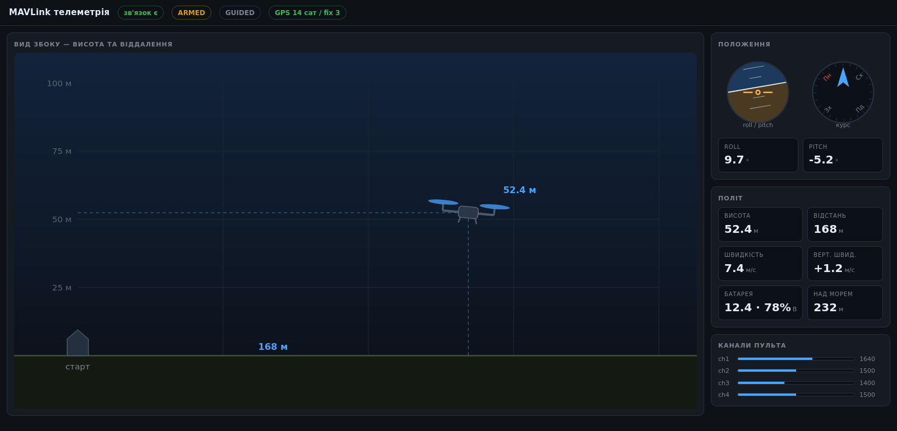

# MAVLink Telemetry Dashboard

Real-time telemetry for ArduPilot vehicles, running on a Raspberry Pi. A Python service reads MAVLink from a flight controller or the ArduPilot simulator and serves a live web dashboard to any browser on the network.



## Features

- **Live flight data:** attitude (roll, pitch, yaw), altitude above takeoff and above sea level, GPS position and fix, ground and vertical speed, battery, arm state, flight mode and RC channels
- **Instrument panel in the browser:** artificial horizon, compass, a side view showing altitude and distance from the takeoff point, and RC channel bars, refreshed 10 times a second
- **No web framework:** the HTTP server and JSON API use only the Python standard library, and the page draws everything with inline SVG
- **Resilient link:** reconnects automatically, marks the link as lost after 5 seconds without data, and keeps shared state thread-safe
- **UDP or serial:** connects to the ArduPilot simulator (SITL) over UDP or to a flight controller over UART
- **Demo mode:** synthetic flight data, so you can run the dashboard without a simulator or hardware

## Architecture

```
ArduPilot flight controller ──UART──┐
                                    ├──► reader thread ──► shared state ──► HTTP server ──► browser
ArduPilot SITL (MAVProxy) ───UDP────┘    (pymavlink)       (lock)          /api/telemetry   (SVG, polls 10 Hz)
```

| File | Purpose |
| --- | --- |
| [`src/dashboard.py`](src/dashboard.py) | MAVLink reader thread, demo generator and HTTP server with the JSON API |
| [`src/static/index.html`](src/static/index.html) | Dashboard page: layout, SVG instruments, polling |
| [`src/read_telemetry.py`](src/read_telemetry.py) | Minimal console reader for attitude, RC channels and altitude |

Distance from the takeoff point uses the haversine formula. The home position comes from the `HOME_POSITION` message, or from the first GPS fix if the flight controller hasn't sent one.

## Getting started

Requires Python 3.11+.

```bash
git clone https://github.com/kontstantinsm2/sm2-ml-tel.git
cd sm2-ml-tel
python3 -m venv venv
source venv/bin/activate
pip install -r requirements.txt
```

### Run the dashboard

```bash
python3 src/dashboard.py --demo                               # synthetic flight data
python3 src/dashboard.py                                      # MAVLink over UDP on port 14550
python3 src/dashboard.py --connect /dev/serial0 --baud 57600  # flight controller over UART
```

Open `http://localhost:8080`, or `http://<raspberry-pi-ip>:8080` from another machine.

| Option | Default | Description |
| --- | --- | --- |
| `--connect` | `udpin:0.0.0.0:14550` | Any pymavlink connection string |
| `--baud` | `57600` | Baud rate for serial connections |
| `--port` | `8080` | HTTP port for the dashboard |
| `--demo` | off | Use synthetic data instead of MAVLink |

### Console reader

```bash
python3 src/read_telemetry.py
```

## Testing with the ArduPilot simulator

Build [ArduPilot SITL](https://ardupilot.org/dev/docs/sitl-simulator-software-in-the-loop.html) on a Linux machine and send MAVLink to the Raspberry Pi:

```bash
sim_vehicle.py -v ArduCopter --console --out=udp:<raspberry-pi-ip>:14550
```

In the MAVProxy console, take off:

```
mode guided
arm throttle
takeoff 20
```

In `GUIDED` mode the autopilot drives the motors directly, so RC channels stay at their idle values. To see them move, switch to `STABILIZE` and override a channel, for example `rc 1 1600`.

## Tech stack

Python 3.11 · pymavlink · MAVLink · ArduPilot SITL · Raspberry Pi OS · HTML/CSS/JavaScript · SVG

## License

[MIT](LICENSE)
